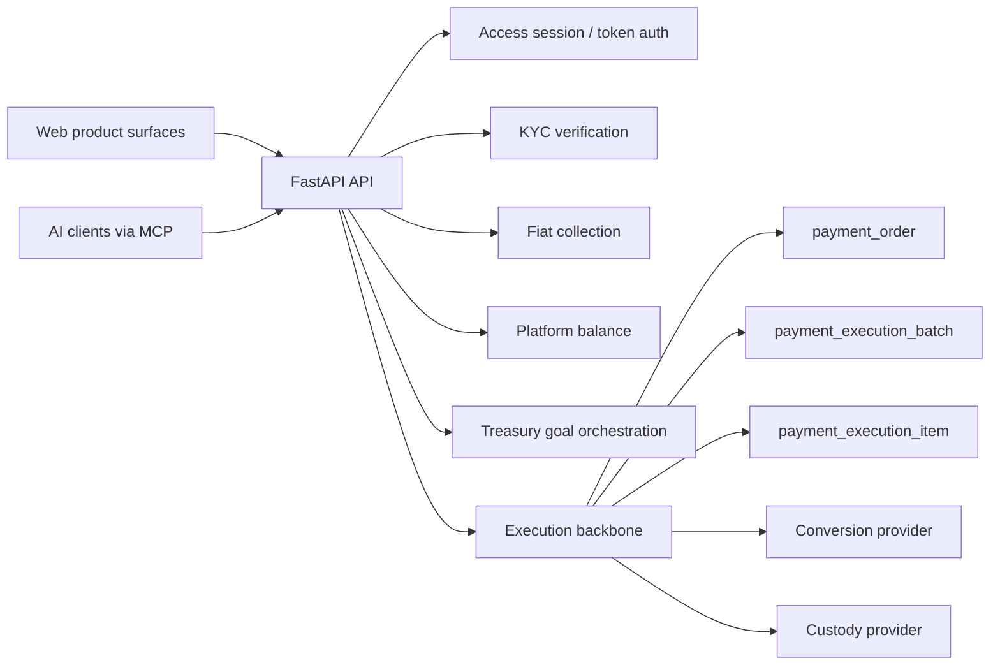

# PayFi Box

[](./LICENSE)

PayFi Box is an enterprise payment orchestration platform that lets businesses continue paying in fiat while the platform handles stablecoin conversion, global settlement, and audit visibility in the background.

Instead of exposing only a final payment status, it keeps one durable settlement backbone across:
- natural-language payment initiation
- merchant fiat collection with KYC gating
- platform balance top-up and balance-funded settlement
- treasury-goal orchestration for “top up, then settle”
- provider-backed conversion and custody payout
- payment detail, timeline, and audit visibility

In practical terms, PayFi Box sits between familiar enterprise payment workflows and a programmable stablecoin settlement rail.

The current product showcase is centered on an `HKD -> e-HKD` funding and settlement path, while keeping the execution model general enough for other supported stablecoins.

## At a Glance

- What it is
  An enterprise payment orchestration layer for fiat-to-stablecoin settlement.
- What users keep
  Familiar fiat payment and operations workflows.
- What the platform adds
  Conversion, settlement coordination, execution visibility, and audit traceability.
- What AI does
  Draft, explain, summarize, and guide next actions without becoming the source of truth for money movement.
- How it integrates
  Through browser surfaces, API access, and MCP tools for external AI clients.

## Why PayFi Box

Most payment products expose only the front of the flow: a request goes in, a status comes back. PayFi Box is built around the execution truth behind that status.

The product is designed for a very specific wedge:
- enterprises still want to operate in fiat
- operations teams still need controlled, reviewable workflows
- finance teams still need traceability and auditability
- AI-native systems increasingly need a safe way to initiate, explain, and coordinate payments

It keeps the full chain visible:
- how a payment request was created
- whether fiat was actually received
- whether KYC or policy checks blocked progress
- whether funds were converted and routed into custody
- how the payout was executed
- what the final audit trail looks like

## Who It Is For

PayFi Box is currently best suited for teams that need payment execution, operations visibility, and programmable access on the same surface.

- Cross-border trade and export-facing businesses
  Continue operating in fiat while gaining a faster settlement rail behind the scenes.
- Platform operators and finance teams
  Keep settlement state, receipt state, and payout progression visible in one workflow.
- Internal reviewers and audit stakeholders
  Inspect timelines, execution items, risk signals, and transfer records without losing payment context.
- AI-native enterprise systems
  Use MCP and API access to connect balance, settlement, and audit actions into larger operational workflows.

## Typical Use Cases

- Enterprise pays in fiat, platform settles in stablecoin
  Keep the payment experience familiar while improving global settlement efficiency behind the scenes.
- Platform treasury workflow
  Top up fiat, convert into stored value, and settle directly from balance with visible state transitions.
- Internal review and post-payment investigation
  Open transfer records, inspect timelines, and review AI-assisted summaries on top of deterministic execution data.
- AI-assisted operations
  Let internal or external AI systems initiate, explain, or coordinate payment workflows through API and MCP boundaries.

## Primary Workflows

- `/command-center`
  Natural-language settlement initiation. Turn a plain-language payment request into preview, risk context, route guidance, and confirmation.
- `/merchant`
  Merchant fiat-in to stablecoin-out operations. Review quote, fiat receipt, KYC, Stripe state, and payout progression on one surface.
- `/balance`
  Platform balance workflow. Top up fiat, convert into stored stablecoin value, and settle directly from balance.
- `/mcp`
  MCP guidance for external AI clients. Shows how access, balance, treasury goals, and settlement tools fit together.
- `/payments/:id`
  Settlement detail and execution truth. Inspect status, timeline, execution items, and audit context.
- `/audit`
  Transfer records and internal review surface for traceability, export, and AI-generated summaries.

## Demo Surfaces

The current repo includes a working local demo across operator, balance, and developer-facing product surfaces.


## 3-Minute Demo Path

For a fast product walkthrough, use this route order:

1. `/access`
   Establish browser access and choose the role-specific demo path.
2. `/command-center`
   Show natural-language initiation and AI-assisted payment structuring.
3. `/merchant`
   Show how a fiat workflow advances into stablecoin settlement operations.
4. `/balance`
   Show deposits, stored value, treasury-style movement, and payment context.
5. `/audit`
   Show transfer records, traceability, and review visibility.
6. `/developers`
   Show API and MCP entrypoints for external systems and AI clients.

This is the clearest way to explain the full product in under three minutes.

## Product Snapshot

- Unified execution backbone
  `payment_order`, `payment_execution_batch`, and `payment_execution_item` stay the source of truth across web and MCP entrypoints.
- Treasury-goal orchestration
  The product can persist a “top up then settle” goal and advance it re-entrantly through KYC, funding, sync, preview, and confirmation.
- Provider-backed production path
  The intended production route is provider-backed conversion plus custody payout, not direct backend-managed hot-wallet execution.
- AI-visible surfaces
  AI is used to draft, explain, summarize, and guide next actions, while ledger state, provider state, and execution state remain deterministic.

## Why It Is Different

PayFi Box is not positioned as a wallet, a chatbot, or a single payment rail.

- Fiat-first user experience
  Businesses do not need to become stablecoin-native just to gain stablecoin settlement efficiency.
- Execution truth over status-only UX
  The product keeps quote, KYC, receipt, payout, and audit state on one continuous line.
- AI with controlled boundaries
  AI helps operators understand and coordinate actions, but deterministic system state remains the final authority for money movement.
- Built for both humans and systems
  The same product can be used by business operators in the browser and by external AI clients through MCP and APIs.

## What AI Enables

AI in PayFi Box is not a cosmetic chatbot layer. It is used to make payment operations easier to understand and safer to coordinate.

- Draft
  Turn natural-language payment intent into structured settlement actions and previews.
- Explain
  Generate operator-facing explanations for payment state, settlement progress, and blocked paths.
- Summarize
  Produce audit-friendly summaries for internal review surfaces.
- Guide
  Recommend the next valid step while keeping money movement, ledger changes, and provider state deterministic.
- Connect
  Expose the product through MCP so external AI clients can use balance, settlement, and audit tools within controlled access boundaries.

## System Model



## Tech Stack

- `apps/api`
  FastAPI application for auth, KYC, merchant settlement, balance funding, treasury goals, MCP, and audit APIs
- `apps/web`
  Next.js application for the product surfaces and operator-facing workflows
- `PostgreSQL`
  Durable state for payments, balances, treasury goals, KYC state, and audit trails
- `Stripe`
  Fiat collection and hosted checkout / identity flows in the current integration path

## Authentication Model

PayFi Box now uses two explicit access paths:

- `POST /api/auth/session`
  Browser-oriented login. Sets an `httpOnly` session cookie and returns session metadata without exposing a bearer token to frontend JavaScript.
- `POST /api/auth/token`
  External-client login for MCP or direct API integrations. Returns a bearer token for non-browser callers.

This keeps browser sessions cookie-managed while preserving explicit token-based access for MCP tooling.

## Secret Boundary

PayFi Box keeps keys and sensitive credentials behind a strict boundary:

- `.env` files
  Store secrets and local configuration only. They must never be committed with live credentials.
- `apps/web/lib/api.ts`
  Centralizes the frontend API wrapper and exposes clean client-side methods.
- Product surface code
  Calls the API wrapper instead of handling provider secrets directly.

This keeps business flows readable in the frontend while leaving secret handling on the server and environment boundary where it belongs.

## Selected API Areas

- Settlement initiation
  - `POST /api/command`
  - `POST /api/confirm`
  - `GET /api/commands`
  - `GET /api/payments`
  - `GET /api/payments/{id}`
- Merchant settlement
  - `POST /api/merchant/quote`
  - `POST /api/merchant/fiat-payment`
  - `POST /api/merchant/fiat-payment/{id}/create-stripe-session`
  - `POST /api/merchant/fiat-payment/{id}/sync-stripe-payment`
- Platform balance
  - `POST /api/balance/deposits`
  - `POST /api/balance/deposits/{id}/start-stripe-payment`
  - `POST /api/balance/deposits/{id}/sync-stripe-payment`
  - `POST /api/balance/payments/preview`
  - `POST /api/balance/payments/confirm`
- Treasury agent
  - `POST /api/balance/goals`
  - `GET /api/balance/goals`
  - `GET /api/balance/goals/{id}`
  - `POST /api/balance/goals/{id}/advance`
  - `POST /api/balance/goals/{id}/confirm`
- KYC
  - `POST /api/kyc/start`
  - `GET /api/kyc/{id}`

## Quick Start

1. Preferred local development mode: hot reload in the foreground.

```bash
make local-dev
```

Use this when you are actively editing code. It will:

- create missing local env files from the checked-in examples
- install dependencies only if they are missing
- start PostgreSQL
- run migrations and idempotent demo seeding
- start Next.js dev mode and Uvicorn reload mode together

2. Preferred local preview mode: production-style build plus background servers.

```bash
make local-preview
```

Use this when you want to review the site as a built app instead of a live-reload dev server.

3. Manual fallback: install dependencies, prepare the database, and seed local data.

```bash
make install
make db
make migrate
make seed
```

4. Manual fallback: start the API and web apps.

```bash
make api-start
make web-start
```

To stop either local mode:

```bash
make local-stop
```

For full local setup details, environment flags, local URLs, seed accounts, and MCP examples, see [docs/local-development.md](docs/local-development.md).

## Release Gates

The repo includes enforced local and CI gates:

- `npm run lint`
- `npm run lint:unused`
- `npm run test:config`
- `npm run test:web`
- `npm run test:api`
- `npm run test:contracts`
- `npm run test`
- `npm run demo:ready` before internal demos
- `npm run demo:check` against the local seeded API before internal demos

CI runs these checks on pull requests and pushes to the main branch.

## Deployment Notes

- Production execution is expected to use provider-backed conversion and custody settlement.
- Browser access should use cookie sessions, not bearer tokens stored in frontend storage.
- Public deployments should keep internal demo surfaces disabled.
- The local/internal demo flow may use seed data and sandbox/mock/provider paths; real Stripe production acquiring and real custody settlement are outside the local demo gate.
- Internal demo flow and fallbacks are documented in [docs/demo-runbook.md](docs/demo-runbook.md).
- Edge rate limiting and WAF rules should be added at the deploy platform in addition to the application-layer login throttling built into the API.
- Required production secrets and fail-fast rules are documented in [docs/production-deployment.md](docs/production-deployment.md).

## Repository Structure

```text
.
├── apps
│   ├── api          # FastAPI backend
│   ├── contracts    # Hardhat contracts and settlement execution tests
│   └── web          # Next.js frontend
├── docs             # public + internal docs
├── infra            # infrastructure notes and assets
├── packages         # reserved for future shared modules (currently empty)
├── scripts          # local and CI helpers
└── .github
```

## Docs

- Public product and repo entry: [README.md](README.md)
- External one-pager: [docs/one-pager.md](docs/one-pager.md)
- External FAQ: [docs/faq.md](docs/faq.md)
- Internal demo runbook: [docs/demo-runbook.md](docs/demo-runbook.md)
- Local development and internal demo notes: [docs/local-development.md](docs/local-development.md)
- Production deployment checklist: [docs/production-deployment.md](docs/production-deployment.md)
- Architecture and engineering notes: [docs/architecture.md](docs/architecture.md)

## License

Apache-2.0. See [LICENSE](LICENSE).
